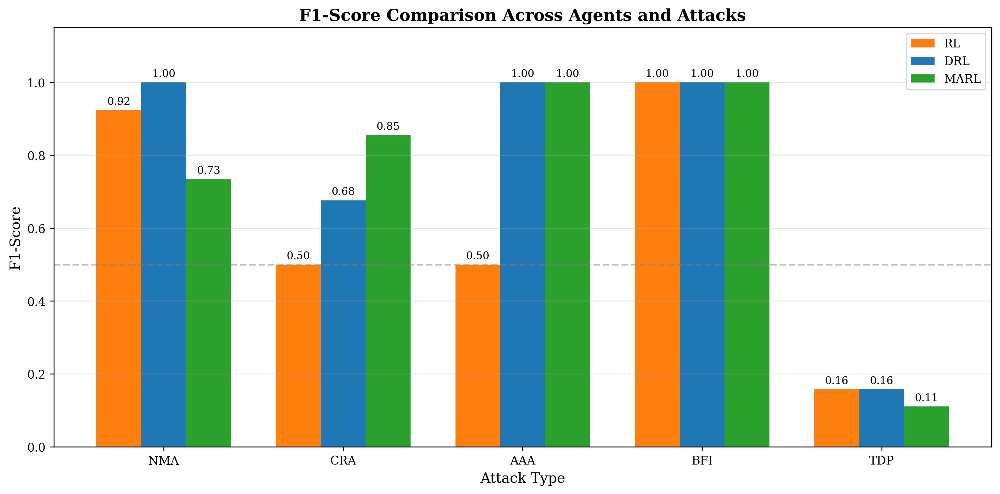
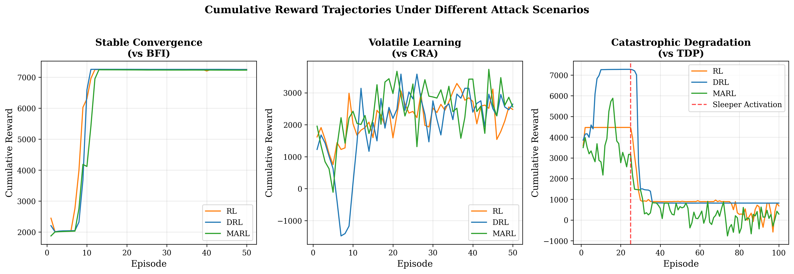

# Adaptive Trust Consensus for Blockchain IoT

[](https://opensource.org/licenses/MIT)
[](https://www.python.org/downloads/)
[](https://arxiv.org/abs/2412.XXXXX)

**Comparing RL, DRL, and MARL Against Naive, Collusive, Adaptive, Byzantine, and Sleeper Attacks**

This repository contains the implementation and experimental framework for our paper on trust-based blockchain IoT security using reinforcement learning.

## 📋 Abstract

We present a trust-based delegated consensus framework integrating Fully Homomorphic Encryption (FHE) with Attribute-Based Access Control (ABAC), combined with learning-based defense mechanisms. We systematically compare three reinforcement learning approaches—tabular Q-learning (RL), Deep RL with Dueling Double DQN (DRL), and Multi-Agent RL (MARL)—against five distinct attack families.

### Key Results

| Attack | RL | DRL | MARL | Best Agent |
|--------|-----|------|------|------------|
| NMA (Naive) | 0.92 | **1.00** | 0.73 | DRL |
| CRA (Collusive) | 0.50 | 0.68 | **0.85** | MARL |
| AAA (Adaptive) | 0.50 | **1.00** | **1.00** | DRL/MARL |
| BFI (Byzantine) | **1.00** | **1.00** | **1.00** | All |
| TDP (Temporal) | 0.16 | 0.16 | 0.11 | None effective |

## 🏗️ Architecture

```
┌─────────────────────────────────────────────────────────────┐
│                   Blockchain IoT System                      │
├─────────────────────────────────────────────────────────────┤
│  IoT Nodes ──► ABAC ──► FHE Engine ──► Trust Management     │
│       │                                      │               │
│       ▼                                      ▼               │
│  Transactions ──► Delegate Selection ──► Consensus Protocol │
│                          ▲                                   │
│                          │                                   │
│                   RL/DRL/MARL Agent                          │
│                   (Adjust delegation ratio)                  │
└─────────────────────────────────────────────────────────────┘
```

## 📁 Repository Structure

```
.
├── main.py                 # Main simulation entry point
├── rl_agent.py            # Tabular Q-learning agent
├── drl_d3p.py             # Dueling Double DQN agent
├── marl_agent.py          # Multi-Agent RL framework
├── trust.py               # Bayesian trust management
├── blockchain.py          # Blockchain simulation
├── tdcb.py                # Trust-Based Delegated Consensus
├── abac.py                # Attribute-Based Access Control
├── fhe.py                 # Fully Homomorphic Encryption
├── reward.py              # Reward function implementation
├── parameters.py          # Simulation parameters
├── attack_util.py         # Attack utilities
├── nma_attack.py          # Naive Malicious Attack
├── cra_attack.py          # Collusive Rumor Attack
├── aaa_attack.py          # Adaptive Adversarial Attack
├── bfi_attack.py          # Byzantine Fault Injection
├── tdp_attack.py          # Time-Delayed Poisoning
├── plot_util.py           # Visualization utilities
├── compare_agents.py      # Agent comparison scripts
├── generate_paper_figures.py  # Generate publication figures
├── results/               # Experimental results (CSV)
├── images/                # Generated figures
├── checkpoints/           # Trained model weights
└── Research_paper_latex_code/  # LaTeX source
```

## 🚀 Quick Start

### Prerequisites

```bash
# Python 3.10+ required
python --version

# Create virtual environment
python -m venv venv
source venv/bin/activate  # Linux/Mac
# or
.\venv\Scripts\activate   # Windows
```

### Installation

```bash
# Clone repository
git clone https://github.com/YOUR_USERNAME/blockchain-iot-trust.git
cd blockchain-iot-trust

# Install dependencies
pip install -r requirements.txt
```

### Running Experiments

```bash
# Run single experiment (DRL vs CRA attack)
python main.py --agent drl --attack cra --nodes 16 --episodes 50

# Run all experiments
python main.py --run_all

# Compare agents
python compare_agents.py
```

### Generate Figures

```bash
# Generate publication-ready figures from results
python generate_paper_figures.py --results_dir ./results --output_dir ./images
```

## 🎯 Attack Models

### 1. Naive Malicious Attack (NMA)
Independent malicious nodes randomly disrupt trust evaluations without coordination.

### 2. Collusive Rumor Attack (CRA)
Coordinated trust manipulation where malicious nodes mutually inflate trust scores while penalizing honest nodes.

### 3. Adaptive Adversarial Attack (AAA)
Intelligent attackers that learn defense patterns and dynamically rotate among five strategies.

### 4. Byzantine Fault Injection (BFI)
Equivocation attacks with Sybil amplification and eclipse attacks to split consensus.

### 5. Time-Delayed Poisoning (TDP)
Sleeper agents that behave honestly to build trust before launching coordinated attacks at episode 25.

## 🤖 Learning Agents

| Agent | Description | Best Against |
|-------|-------------|--------------|
| **RL** | Tabular Q-learning with discretized states | BFI, NMA |
| **DRL** | Dueling Double DQN with continuous states | NMA, AAA, BFI |
| **MARL** | Parameter-sharing multi-agent framework | CRA (coordinated attacks) |

## 📊 Results

### F1-Score Comparison


### Learning Dynamics


### TDP Attack Effect


## 🔧 Configuration

Key parameters in `parameters.py`:

```python
N_NODES = 16              # Number of IoT nodes
MALICIOUS_RATIO = 0.30    # Fraction of malicious nodes
TRUST_THRESHOLD = 0.45    # Classification threshold
EPISODES = 50             # Training episodes (100 for TDP)
STEPS_PER_EPISODE = 30    # Steps per episode
```

## 📈 Reproducing Results

To reproduce all results from the paper:

```bash
# Run complete experimental matrix (15 combinations)
# Warning: Takes ~4 hours
python main.py --run_all --seed 42

# Generate all figures
python generate_paper_figures.py --results_dir ./results --output_dir ./new_res --nodes 16
```

## 📄 Citation

If you use this code in your research, please cite:

```bibtex
@article{padia2025adaptive,
  title={Adaptive Trust Consensus for Blockchain IoT: Comparing RL, DRL, and MARL Against Naive, Collusive, Adaptive, Byzantine, and Sleeper Attacks},
  author={Padia, Soham and Vaidya, Dhananjay and Mangrulkar, Ramchandra},
  journal={arXiv preprint arXiv:2412.XXXXX},
  year={2025}
}
```

## 📜 License

This project is licensed under the MIT License - see the [LICENSE](LICENSE) file for details.

## 🙏 Acknowledgments

- Northeastern University
- Dwarkadas J. Sanghvi College of Engineering

## 📧 Contact

- Soham Padia - padia.so@northeastern.edu
- Dhananjay Vaidya - dhananjayvaidya4154@gmail.com
- Ramchandra Mangrulkar - ramchandra.mangrulkar@djcse.ac.in

## ⚠️ Ethical Considerations

This research documents attack mechanisms for defensive purposes. The attacks exploit fundamental properties of trust systems rather than specific implementation vulnerabilities. Real-world deployment of such attacks may violate computer fraud laws.